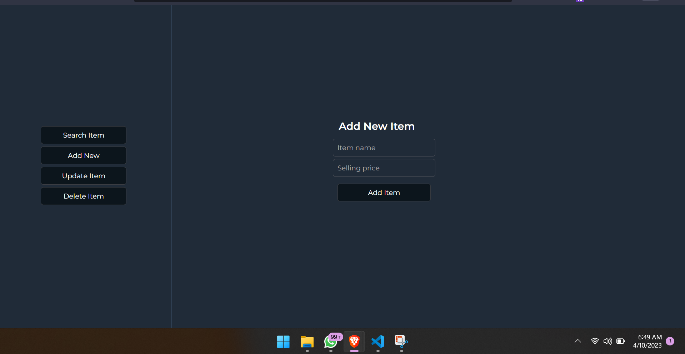

# Arlington Sprouts PHP Database Project README

This README provides instructions on how to set up and run the Arlington Sprouts PHP project. The project includes PHP scripts that connect to the Arlington Sprouts database and perform various operations.

# Prerequisites

--XAMPP or a similar local server solution installed
--Text editor of your choice (e.g., Visual Studio Code, Notepad++, or Sublime Text)

# Setting Up the Project

--Create a new folder named "arlington_sprouts" inside the "htdocs" folder of your XAMPP installation.
--Add the following folders --  assets   --css/awesome.css
                                         --js/awesome.js
                                        The files above are already provided in the current Folder
--Create a file named "dbConnect.php" in the "arlington_sprouts" folder and paste the provided database connection code into the file.
--Create a file named "index.php" in the "arlington_sprouts" folder.
--Copy the PHP scripts from each question into "index.php" and wrap each script in a function. Name each function accordingly (e.g., function question1() { ... }).
--Add the line require_once "dbConnect.php"; at the beginning of "index.php" to include the database connection file.

# Running the Project

--Start the XAMPP Control Panel and ensure that the Apache and MySQL modules are running.
--Open a web browser and go to http://localhost/arlington_sprouts/index.php.
--To test each function, call the function inside "index.php" by clicking on its corresponding button.

# Organizing the Project

You can further organize the project by separating each question into its own PHP file (e.g., "question1.php", "question2.php", etc.) and including them in "index.php" using require_once.
You can also create separate HTML files for each question's form to keep the project organized.

# Notes

Remember to save your project files in a safe location on your computer for future reference or modifications.
When making changes to the PHP scripts or running new queries, always make sure to double-check the SQL syntax to avoid errors.
Now you have the Arlington Sprouts PHP project set up and ready to run. You can execute the scripts to perform various operations on the database and view the results in your web browser.

# THE VIEW QUESTION

The SQL code to create views is located in the Report.md File together with the explanation
